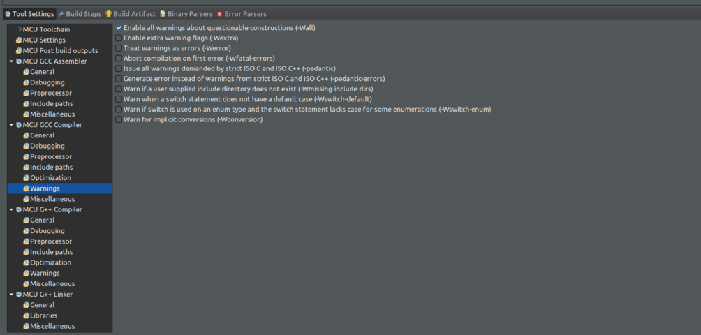
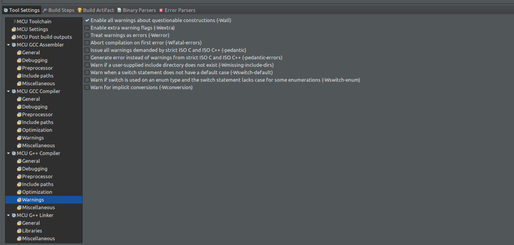

# Compiler settings

## All Compiler options available in STM32CubeIDE for C C++

> **NOTE:**
> - [STM32 C CPP build settings](stm32_c_cpp_build_settings.json)
> - Uncomment **-u _printf_float**, **-u _scanf_float** tags in target_link_options if necessary.
> - **-lstdc++**, **-lsupc++** tags are not needed in target_link_options for C project.

